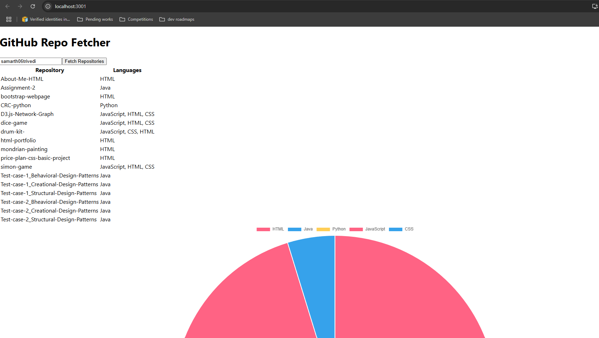

# Repos-dashboard
Building a full-stack app to fetch GitHub repositories and visualize language usage with a pie chart and table using Node.js and React.

This project is a hands-on learning experience where I build a full-stack application to interact with the GitHub API. On the backend, I use Node.js and Express to create an API that fetches a user's repositories along with the programming languages used in each repo. On the frontend, I use React to create an interactive user interface that allows users to input a GitHub user ID and view the repositories in a table format. Additionally, I implement a pie chart to visually represent the distribution of programming languages across the repositories.

Through this project, I am learning how to:

Work with APIs and handle asynchronous requests.
Use Node.js and Express to create a RESTful API.
Fetch and display data dynamically in a React application.
Visualize data with charts using Chart.js.
Understand how to structure a full-stack application.
This project helps me understand the fundamentals of web development and provides practical experience in building and deploying an application that integrates both frontend and backend technologies.

